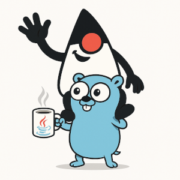

# GJG Launcher
[](https://go.dev)
[](https://github.com/kaffamobile/gjg/releases)
[](https://opensource.org/licenses/MIT)
[](https://github.com/kaffamobile/gjg/actions)

**GJG Launcher** is a lightweight Go-based executable wrapper designed to replace [Launch4j](https://launch4j.sourceforge.net/) for running Java/Kotlin applications on Windows.  
It was created at **Kaffa** to solve issues where Launch4j crashes at native level when handling `JAVA_OPTS` or arguments containing special characters such as quotes.

Instead of embedding complex C code, GJG delegates execution directly to the JVM while providing a simple configuration file and robust argument handling.

---



## ✨ Features

- ✅ Self-contained `.exe` for Windows
- ✅ Reads a `.gjg.conf` file to locate your JAR, JVM options, application arguments, and environment variables
- ✅ Handles quoted arguments and special characters safely
- ✅ Supports debug and dry-run modes
- ✅ Creates detailed logs when running in debug mode
- ✅ Portable: ship one `.exe` alongside your JAR and config file

---

## 📦 Installation

Download the latest release binaries from the [Releases](../../releases) page.  
Each release includes prebuilt executables for:

- Windows x64
- Windows x86
- Windows ARM64

Place the launcher `.exe`, its `.gjg.conf`, and your `.jar` file **in the same folder and with the same base name**.

For example:

```
myapp.exe
myapp.gjg.conf
myapp.jar
```

---

## ⚙️ Configuration

The `.gjg.conf` file must share the same base name as your executable.  
Example for `myapp.exe`:

**myapp.gjg.conf**

```ini
# Path to Java installation (optional).
# Can be absolute or relative. If empty, Java will be resolved from PATH.
java_dir=runtime/java-17

# Application JAR to launch. Can also be absolute or relative
jar_file=myapp.jar

# Arguments passed to the JVM
jvm_args=-Xmx512m -Dfile.encoding=UTF-8

# Arguments passed to your application
app_args=--server.port=8080 --profile=prod

# Extra environment variables (prefix with env_)
env_MY_ENV_VAR=production

# Override existing env variable (prefix with env_)
env_PATH=/path/to/private/bin
```

### Embedded Java example

You can ship your application with an embedded JDK/JRE.  
For example, bundle it in a folder `runtime/java-17/` next to your files, then set:

```ini
java_dir=runtime/java-17
```

The launcher will resolve `runtime/java-17/bin/javaw.exe`.

### Special flags

- `--gjg-debug`  
  Enables debug mode, prints and logs extra information.

- `--gjg-dry-run`  
  Shows what would be executed but does not start Java (implies debug mode).

---

## 📝 Logs

When run with `--gjg-debug`, logs are written to:

```
%LOCALAPPDATA%\gjg\<exe-name>\gjg-debug.log
```

On Linux/macOS (for testing/debugging only):

```
$XDG_CACHE_HOME/gjg/<exe-name>/gjg-debug.log
```

The log contains details such as resolved paths, JVM arguments, forwarded arguments, and process exit codes.

---

## 🛠 Development

This repository already includes an example JAR in the root folder for testing.  
To develop or debug:

1. Open the project in your IDE of choice (VS Code, GoLand, IntelliJ, etc.).
2. Run `main.go` directly — the default config and example JAR will be picked up.
3. You can use the included VS Code launch configuration (`.vscode/launch.json`) for quick start.

Standard Go tasks (`build`, `test`, etc.) can also be run via [Mage](https://magefile.org/):

```bash
mage build   # Build executables
mage test    # Run tests
mage clean   # Clean artifacts
```

## 🔌 Maven Plugin

For Maven users, we provide an official plugin that automates the entire packaging process:

**[GJG Maven Plugin](https://github.com/kaffamobile/gjg-maven-plugin)** - Package your Java applications with GJG directly from Maven.

### Quick Setup

Add to your `pom.xml`:
```xml
<plugin>
    <groupId>io.github.kaffamobile.tools.maven</groupId>
    <artifactId>gjg-maven-plugin</artifactId>
    <version>1.0.0</version>
    <executions>
        <execution>
            <phase>package</phase>
            <goals>
                <goal>package</goal>
            </goals>
        </execution>
    </executions>
    <configuration>
        <!-- Output executable -->
        <outputFile>${project.build.directory}/${project.artifactId}.exe</outputFile>
        
        <!-- JAR configuration -->
        <jarFile>./${project.artifactId}.jar</jarFile>
        
        <!-- Java runtime -->
        <javaDir>./runtime/jre-17</javaDir>
        
        <!-- Architecture: amd64, 386, or arm64 -->
        <arch>amd64</arch>
        
        <!-- JVM arguments -->
        <jvmArgs>
            <arg>-Xms256m</arg>
            <arg>-Xmx2048m</arg>
            <arg>-Dfile.encoding=UTF-8</arg>
            <arg>-Djava.library.path=./libs</arg>
        </jvmArgs>
        
        <!-- Application arguments -->
        <appArgs>
            <arg>--server.port=8080</arg>
            <arg>--profile=production</arg>
        </appArgs>
        
        <!-- Environment variables -->
        <env>
            <APP_HOME>C:\MyApp</APP_HOME>
            <LOG_LEVEL>INFO</LOG_LEVEL>
        </env>
        
        <!-- Windows metadata -->
        <icon>src/main/resources/app.ico</icon>
        <fileDescription>My Application</fileDescription>
        <productName>MyApp Professional</productName>
        <productVersion>1.0.0.0</productVersion>
        <companyName>My Company Ltd.</companyName>
        <copyright>© 2024 My Company Ltd.</copyright>
    </configuration>
</plugin>
```

## 📄 License

This project is licensed under the [MIT License](./LICENSE).  
